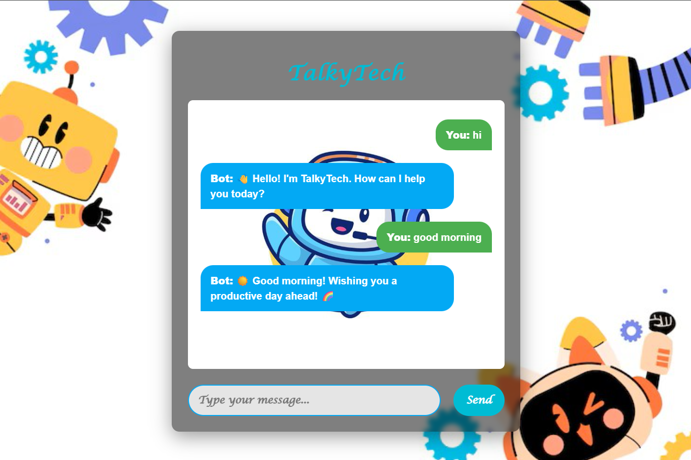

# 🚀 TalkyTech Chatbot



A **fun and interactive rule-based chatbot** built with **Python** and **Flask**. TalkyTech can respond to greetings, answer basic questions, tell jokes, give advice, and more!  

> Note: This project is **rule-based**, so responses are generated using keywords. No AI/NLP is currently implemented, but it’s ready for future upgrades.

---

## ✨ Features

- 💬 **Real-time chat** via a web interface  
- 🧑‍💻 **Personalized greetings** with user name detection  
- 😂 **Fun responses**: jokes, facts, greetings, and advice  
- 🗂 **Modular code**: Responses stored in `long_response.py`  
- 🌐 **Simple and lightweight**: Runs locally using Flask  

---

## 📸 Demo / Output


**Example Interaction:**
You: Hello
Bot: 👋 Hello! I'm TalkyTech. How can I help you today?

You: My name is Mohini
Bot: ✨ Nice to meet you, Mohini! How can I assist you?

You: Tell me a joke
Bot: 😆 Want to hear a joke? Just say "tell me a joke"! 🤪


## 🛠 Installation & Setup

1. **Clone the repository:**
```bash
git clone https://github.com/mohini-pasi/Talkytech.git
cd Talkytech
```
Install dependencies:

```bash
Copy code
pip install flask
```
Run the application:

```bash
Copy code
python app.py
```
Open your browser and go to:

```cpp
Copy code
http://127.0.0.1:5000/
```

## 🗂 Project Structure
```php
Copy code
TalkyTech/
│
├─ app.py                # Main Flask application
├─ long_response.py      # Stores long predefined replies
├─ templates/
│   └─ index.html        # Frontend HTML page
├─ static/
│   ├─ styles.css        # CSS styling
│   └─ images/           # Images used in frontend
├─ output/               # Screenshot of chatbot output
│   └─ output.png
```

## 🔮 Future Improvements
Implement NLP / AI for smarter responses

Add voice interaction

Enhance UI with chat animations and emojis

Integrate database to remember past conversations

## ⚡ How it Works
User types a message in the chatbox

Flask backend receives input via /get_response route

get_response() function processes the input using keyword matching

Bot selects the best response from predefined responses in long_response.py

Response is sent back to the frontend and displayed in real-time

## 📌 Notes
This project is a rule-based chatbot; no machine learning or NLP is used yet

Code is modular, making it easy to add new responses or upgrade to AI-based

##  Made with ❤️ by Mohini Pasi

```yaml
Copy code

---

If you want, I can also make a **GitHub-ready version with badges, colors, and a better layout** so it looks professional and eye-catching.  

Do you want me to do that?
```
